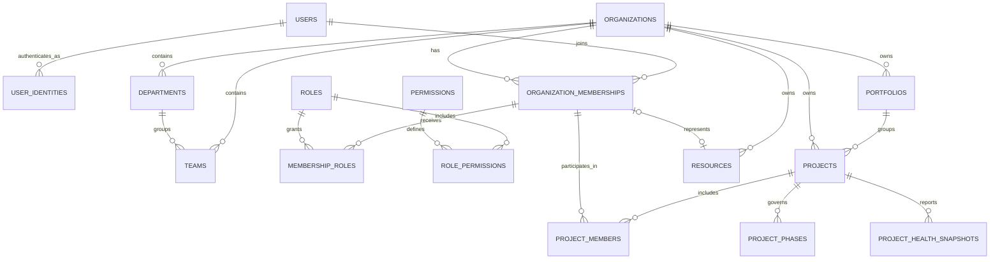

# PMCS normalized data model and legacy migration plan

**Status:** proposed target design; no database or application changes are made by
this document.

**Decision:** build the new relational model beside the legacy prototype, migrate
and reconcile data into it, and cut over one domain at a time with exactly one
write authority per domain. Do not try to turn `public.records.data` into the
new model in place.

## 1. Evidence reviewed

The current backend is a generic register store, not a normalized project-control
database:

| Existing object | Observed design | Consequence for PMCS |
|---|---|---|
| `users` | Global username, one string `role`, no organization or membership | Cannot support tenant-scoped RBAC, custom roles, invitations, sessions, or MFA. |
| `records` | `module`, optional `external_id`, arbitrary JSON `data`, generic status/version | Project, task, financial, risk, and change data have no foreign keys, data types, or tenant boundary. |
| `audit_logs` | Mutable ordinary table; user/entity identifiers are strings without FKs | It is not append-only evidence and cannot establish organization scope. |
| `approvals` | One record reference and one approver role string | No workflow template, step, assignee, decision actor, or controlled state transition. |
| `report_schedules` / `report_runs` | JSON recipient list, no organization/project links | Recipient ownership, retention, and report provenance are not enforceable. |
| `notifications` | User reference only, no FK or organization | A notification cannot be scoped or safely queried by tenant. |

The current schema is defined only by
[`backend/app/models.py`](../../backend/app/models.py) and Alembic revisions
[`0001_initial.py`](../../backend/alembic/versions/0001_initial.py) and
[`0002_add_performance_indexes.py`](../../backend/alembic/versions/0002_add_performance_indexes.py).
There are no foreign keys in either revision. The second revision adds lookup
indexes but does not change that fact.

The Vite fallback dataset in [`src/data.js`](../../src/data.js) is useful as an
import specification, but is not proof that equivalent rows exist in PostgreSQL.
The import endpoint can store arbitrary workbook sheet names and cells as JSON in
`records`.

### Material legacy-data risks to resolve before import

- The task sample is column-shifted: `Actual Finish` contains a decimal,
  `% Complete` contains a text status, `Status` contains a money value, and
  `Planned Cost` contains what appears to be an actual-cost value. This must
  be mapped from a signed source-workbook dictionary, never guessed in a script.
- `Project Charter.Approved Budget` is `#VALUE!`. The approved-budget lines
  total 5,000,000; their contingency totals 300,000; WBS budgets total
  5,300,000; and EVM BAC is 5,000,000. Finance must decide whether contingency
  is inside BAC before an approved baseline is created.
- Budget and actual-cost rows use WBS `1.1`, but the supplied WBS sample has
  only top-level IDs `1` through `10`. Such rows must enter the exception
  queue unless a signed crosswalk resolves them.
- Progress, EVM, and several calculated fields are Excel formula text. Formulas
  are not authoritative values and must be retained as source evidence, not
  parsed as dates, money, or status.
- Responsible-person names and resource `Task/WBS` strings are not stable
  identifiers. They must not be silently matched to accounts or task records.

## 2. Target database boundary and conventions

The target schema is a PostgreSQL namespace named `pmcs`. The existing
`public` tables remain untouched during migration and are treated as a legacy
source. The future Prisma datasource should explicitly target `pmcs`; the
legacy application continues to use `public` until its agreed cutover.

| Convention | Target rule |
|---|---|
| Keys | `uuid`, generated with `gen_random_uuid()`; legacy string UUIDs are cast only after validation. |
| Tenant keys | Every tenant-owned table has non-null `organization_id uuid`. Parents expose `UNIQUE (organization_id, id)`; children use composite foreign keys containing `organization_id`. |
| Time | `timestamptz` for events, UTC only; `date` for plans and accounting dates. |
| Money/quantity | `numeric(19,4)` for money, `char(3)` ISO currency, `numeric(18,4)` for quantity/rates, and `numeric(5,4)` for fractions in the range 0–1. Never use floating point for financial or EVM calculations. |
| Text and states | Use `text` with check constraints for platform states and tenant-owned lookup/configuration tables for configurable classifications. Avoid PostgreSQL enums because workflow changes need safe migrations. |
| JSONB | Allowed for redacted audit payloads, retained source rows, report filters, and explicitly extensible metadata. It must not hold IDs, relationships, dates, money, workflow state, or a PMCS core aggregate. |
| Lifecycle | Operational records may have `deleted_at` / `deleted_by_membership_id`. Users are deactivated. Financial entries, approved baselines, approval decisions, report evidence, and audit events are never soft-deleted or overwritten. |
| Concurrency | Mutable aggregates carry `version integer not null default 1`; command endpoints require the expected version. |
| Provenance | Controlled tables carry `created_at`, `created_by_membership_id`, `updated_at`, and `updated_by_membership_id` where a change is allowed. Immutable tables carry creation/finalization actors only. |

Tenant tables must not merely *filter* by organization in application code. For
example, a task table has both `organization_id` and `project_id` and uses:

    UNIQUE (organization_id, id)
    FOREIGN KEY (organization_id, project_id)
      REFERENCES pmcs.projects (organization_id, id)

The same pattern prevents a valid project UUID from another organization being
attached to a task by mistake or by a faulty query.

### RLS defense in depth

All tenant-owned tables receive `ENABLE ROW LEVEL SECURITY` and `FORCE ROW
LEVEL SECURITY`. The API transaction must set, after membership authorization:

    SET LOCAL pmcs.organization_id = '<authorized organization UUID>';
    SET LOCAL pmcs.membership_id = '<authorized membership UUID>';

The baseline policy shape is:

    USING (
      organization_id =
      current_setting('pmcs.organization_id', true)::uuid
    )
    WITH CHECK (
      organization_id =
      current_setting('pmcs.organization_id', true)::uuid
    );

The application role cannot use `BYPASSRLS`. A separate, tightly controlled
migration/backup role is the only role permitted to bypass policies. The API
must execute `SET LOCAL` and the query in the same transaction; a client
header is not a tenant assertion.

## 3. Normalized logical ERD

The diagrams deliberately show authoritative relationships only. Dashboard
aggregates and search documents are derived read models, not sources of truth.

### 3.1 Tenant, identity, and project controls

### 3.2 Schedule, baseline, financial, and control domains

```mermaid
erDiagram
  PROJECTS ||--o{ WBS_ITEMS : decomposes
  WBS_ITEMS o|--o{ WBS_ITEMS : parent_of
  PROJECT_PHASES ||--o{ WBS_ITEMS : groups
  WBS_ITEMS ||--o{ TASKS : contains
  TASKS o|--o{ TASKS : parent_of
  TASKS ||--o{ TASK_DEPENDENCIES : successor
  TASKS ||--o{ TASK_ASSIGNMENTS : assigned
  RESOURCES ||--o{ TASK_ASSIGNMENTS : performs
  PROJECTS ||--o{ MILESTONES : tracks
  PROJECTS ||--o{ BASELINES : freezes
  BASELINES ||--o{ BASELINE_WBS_ITEMS : snapshots
  BASELINES ||--o{ BASELINE_TASKS : snapshots
  BASELINES ||--o{ BASELINE_MILESTONES : snapshots
  BASELINES ||--o{ BASELINE_BUDGET_ITEMS : snapshots
  PROJECTS ||--o{ BUDGET_VERSIONS : plans
  BUDGET_VERSIONS ||--o{ BUDGET_LINE_ITEMS : contains
  PROJECTS ||--o{ COST_TRANSACTIONS : incurs
  COST_TRANSACTIONS ||--o{ COST_TRANSACTION_LINES : allocates
  PROJECTS ||--o{ COMMITMENTS : commits
  PROJECTS ||--o{ FORECAST_VERSIONS : forecasts
  FORECAST_VERSIONS ||--o{ FORECAST_LINE_ITEMS : contains
  PROJECTS ||--o{ EVM_SNAPSHOTS : measures
  PROJECTS ||--o{ RISKS : manages
  RISKS ||--o{ RISK_ASSESSMENTS : assesses
  RISKS ||--o{ RISK_ACTIONS : treats
  PROJECTS ||--o{ ISSUES : tracks
  ISSUES ||--o{ ISSUE_ACTIONS : resolves
  PROJECTS ||--o{ CHANGE_REQUESTS : controls
  CHANGE_REQUESTS ||--o{ CHANGE_IMPACTS : assesses
  APPROVAL_REQUESTS o|--o| CHANGE_REQUESTS : governs
  APPROVAL_REQUESTS ||--o{ APPROVAL_STEPS : has
  APPROVAL_STEPS ||--o{ APPROVAL_DECISIONS : records
```

## 4. Physical table catalogue

The column lists below are the proposed Prisma/PostgreSQL contract. Standard
provenance columns from section 2 are omitted only where they would obscure the
domain columns; they are still required.

### 4.1 Identity, organization, and authorization

| Table | Essential columns and constraints |
|---|---|
| `users` | `id`, `display_name`, `status` (`active`, `suspended`, `invited`, `closed`), `last_login_at`. This is a global identity and has no `organization_id`. |
| `user_identities` | `id`, `user_id FK`, `provider` (`local`, `oidc`, etc.), `issuer`, `subject`, `login_identifier citext`, `verified_at`; unique provider/issuer/subject and a partial unique index on the normalized local identifier. |
| `password_credentials` | `user_id PK/FK`, `password_hash`, `algorithm`, `changed_at`, `must_rotate`. Target algorithm is Argon2id. A temporary legacy bcrypt verifier is a migration compatibility state, not a permanent algorithm. |
| `auth_sessions`, `mfa_factors`, `password_reset_tokens`, `email_verification_tokens` | Hashes/tokens only, expiry/revocation timestamps, device metadata, and user FK. Secrets and raw reset tokens are never retained. |
| `organizations` | `id`, unique `slug`, `legal_name`, `display_name`, `default_currency`, `status`, `settings jsonb`. |
| `departments`, `locations`, `teams` | Tenant-scoped names/codes; `teams.department_id` optional; unique organization/code where a code exists. |
| `organization_memberships` | `id`, organization/user FKs, `department_id` optional, `status`, joined/ended dates; unique `(organization_id, user_id)`. All tenant actor references point here rather than to an unscoped role string. |
| `permissions` | Platform-owned `code` such as `project:read:portfolio`; unique code and immutable semantic description. |
| `roles` | Tenant-scoped `id`, `organization_id`, `code`, `name`, `is_system`; unique `(organization_id, code)`. Seed copies of default roles are regular tenant roles, so customisation is explicit. |
| `role_permissions` | Composite PK `(role_id, permission_id)`; tenant-safe role FK. |
| `membership_roles` | Composite PK `(organization_membership_id, role_id)`; each side must share organization. |
| `team_memberships`, `organization_invitations` | Membership/team relation and invitation email, role selections, expiry, acceptance/revocation evidence. |

The default role names in the product specification are seed data, not hard-coded
authorization branches. Permission checks resolve membership → roles →
permissions and then apply project membership and attribute policies.

### 4.2 Portfolio, project, people, and resource management

| Table | Essential columns and constraints |
|---|---|
| `portfolios` | `id`, `organization_id`, `parent_portfolio_id` nullable, `code`, `name`, `owner_membership_id`, `status`; unique organization/code. A deferred cycle check protects the hierarchy. |
| `strategic_objectives`, `project_strategic_objectives` | Tenant strategy records and a project/objective bridge with contribution/weight. |
| `projects` | `id`, `organization_id`, `portfolio_id` nullable, `code`, `name`, `description`, `lifecycle_status`, `priority`, `health`, `sponsor_membership_id`, `manager_membership_id`, planned/actual start and finish, currency, `version`; unique `(organization_id, code)`. |
| `project_members` | Project/member bridge with `membership_role` (project-local responsibility, not authorization role), `joined_at`, `left_at`; unique active project/member pair. |
| `project_status_reports` | Reporting period, narrative, submitted/approved actor/timestamps, and source data timestamp. This is a controlled report rather than a mutable dashboard field. |
| `project_health_snapshots` | Calculation time, rule-set version, schedule/cost/scope/risk/overall health, metrics JSONB only for derived display values, source watermark. Immutable snapshots permit dashboard history. |
| `resources` | `id`, `organization_id`, optional `membership_id`, `resource_type` (person, team, contractor, equipment), display name, department/team, active range. A contractor/team need not have a login. |
| `resource_rates` | Resource, effective date range, rate, currency, unit (hour/day/month), approval fields. Prevent overlapping active rates per resource/unit/currency. |
| `resource_capacities` | Resource, date range, available units/capacity percent. |
| `resource_allocations` | Resource, project, optional WBS/task, start/end date, planned/actual units, rate reference. Add a range index for utilization/over-allocation checks. |

### 4.3 Planning and delivery

| Table | Essential columns and constraints |
|---|---|
| `project_phases` | Project, `code`, `name`, sort order, planned/actual dates, lifecycle state; unique project/code. |
| `wbs_items` | Project, phase optional, `parent_wbs_item_id` nullable, `code`, `name`, description, item type, sort order, planned/forecast/actual dates, owner membership, status, percent complete, `version`; unique `(project_id, code)`. |
| `tasks` | Project, WBS item, optional parent task, `code`, name/description, priority, status, planned/forecast/actual dates, planned effort, progress method, percent complete, owner membership, `version`; unique `(project_id, code)`. |
| `task_dependencies` | Project, predecessor task, successor task, dependency type (FS/SS/FF/SF), lag days; unique predecessor/successor/type. Check predecessor <> successor; service plus a deferred database cycle check reject graph cycles. |
| `task_assignments` | Task/resource, assignment role, planned/actual units/effort, start/end, status; unique task/resource/assignment role/date range as appropriate. |
| `task_progress_updates` | Immutable progress observations: task, reporting date, actual percent, actual effort, narrative, blockers, reporter membership. The current task state is updated transactionally from an accepted update. |
| `milestones` | Project, optional phase/WBS/task, `code`, name, planned/forecast/actual date, status, critical flag, owner membership, `version`; unique project/code. |
| `plan_periods` | Time-phased annual/monthly plan item: project, WBS/task optional, period start/end, planned output, planned amount/effort, owner membership. This imports the legacy “Annual & Monthly Plan” without putting time periods in a task JSON field. |
| `workstreams`, `workstream_items` | Optional first-class implementation/workstream records for the existing AI & software worksheet. They can link to a phase/WBS/task but do not substitute for the schedule hierarchy. |
| `tags`, `project_tags`, `task_tags` | Tenant-owned labels and explicit bridge tables. |

WBS hierarchy and task hierarchy are deliberately distinct: WBS is the governed
scope/schedule decomposition; a task can be a child task without inventing a
new WBS node.

### 4.4 Baselines, budgets, cost, forecast, and EVM

| Table | Essential columns and constraints |
|---|---|
| `baselines` | Project, sequential `baseline_no`, name, status (`draft`, `pending_approval`, `approved`, `superseded`, `cancelled`), scope/schedule/budget inclusion flags, source version watermark, `approval_request_id`, `frozen_at/by`, `approved_at/by`. Unique project/baseline number. |
| `baseline_wbs_items` | Immutable snapshot of code, parent code, phase code, name, dates, effort, cost, and scope fields for every included WBS item. |
| `baseline_tasks` | Immutable snapshot of task code, WBS code, parent task code, dates, duration, planned effort/cost, progress method, dependency input reference. |
| `baseline_milestones` | Immutable milestone code/name/date/criticality snapshot. |
| `baseline_budget_items` | Immutable approved amount, contingency, currency, category, funding source, period, WBS code, and cost-item snapshot. |
| `cost_categories`, `funding_sources`, `suppliers` | Tenant financial reference data. A supplier is a project-control payee reference, not a replacement for an ERP vendor master. |
| `budget_versions` | Project, sequential version, `kind` (working/forecast/approved), status, currency, effective date, superseded version, `approval_request_id`; unique project/version. Approved versions are locked and copied into a baseline when selected as baseline budget. |
| `budget_line_items` | Budget version, optional WBS/task, category/funding source, description, period, quantity, unit, unit rate, planned amount, approved amount, contingency amount, currency. |
| `cost_transactions` | Immutable accounting-control header: project, transaction type (actual/accrual/adjustment/reversal), external reference, supplier, transaction/payment dates, payment status, reversal target, source import key, posted/void state. A correction creates an adjustment or reversal; it never edits a posted amount. |
| `cost_transaction_lines` | Transaction line, optional WBS/task/budget line, category, quantity, unit cost, amount, currency. Line amounts reconcile to the transaction total. |
| `commitments`, `commitment_lines` | Purchase/contract commitments and allocated lines, including release/cancellation/revision links. |
| `forecast_versions`, `forecast_line_items` | Periodic ETC/EAC forecasts with scenario, as-of date, line-level amount, currency, WBS/task/budget association. Closed forecast versions are immutable. |
| `evm_snapshots`, `evm_values` | Project snapshot with reporting date, selected approved baseline, calculation rule version, and signed source watermark; child values by project/WBS/task hold PV, EV, AC, BAC, EAC, ETC, VAC, CV, SV, CPI, SPI, TCPI as decimal results. |

All financial reports calculate from approved budget versions, posted cost
transaction lines, commitment lines, and closed forecast/EVM snapshots. They do
not calculate from front-end formulas or task spreadsheet cells.

### 4.5 Risks, issues, changes, approvals, and collaboration

| Table | Essential columns and constraints |
|---|---|
| `risks` | Project, code, category, title/description, cause, consequence, owner membership, status, target/review dates, escalation state, `version`; unique project/code. |
| `risk_assessments` | Immutable dated inherent/residual probability and impact, computed scores/levels, assessor membership, rationale. The current risk assessment is selected by FK or latest accepted record. |
| `risk_actions` | Risk, action type (mitigation/contingency/monitoring), owner, due/completed dates, status, outcome. |
| `issues` | Project, code, description, category, priority, impact, owner, raised/due/closed dates, root cause, resolution, status, escalation, `version`; unique project/code. |
| `issue_actions` | Issue corrective/preventive action, owner, due/completed dates, status, result. |
| `change_requests` | Project, code, requester membership or external requester text, requested date, description/reason/category/priority, state, implementation state, `approval_request_id`, submitted/closed timestamps; unique project/code. |
| `change_impacts` | Change request and dimension (scope/schedule/cost/resource/risk/benefit), baseline/current/proposed values, currency or days where relevant, impact narrative, assessor. More than one impact can be retained as analysis evolves. |
| `change_implementations` | Accepted change, implementation owner, approved plan, started/completed/verified dates, verification actor/result. |
| `approval_workflow_templates` | Organization/project applicability, controlled subject kind, name/version/active state. |
| `approval_workflow_stages` | Template, sequence, quorum, required role/permission, escalation time. |
| `approval_requests` | Organization/project, template version, requester membership, status, requested/closed times. The controlled record points to this request by FK, avoiding an unconstrained generic `subject_id`. |
| `approval_steps` | Approval request/stage, state, due date, assignee membership or required role snapshot. |
| `approval_decisions` | Immutable step decision: actor membership, decision, comment, decided timestamp, delegation/evidence reference. A decision actor is required. |
| `meetings`, `meeting_attendees` | Project meeting records and attendance. |
| `decisions`, `action_items` | Decision, owner, due date/status, optional meeting and optional source change/risk/issue. A legacy “Decision Log” row becomes one or both depending on signed classification. |
| `documents`, `document_versions` | Tenant/project document metadata, storage key, SHA-256, MIME/size, scan status, uploader, version sequence. Document bytes never enter PostgreSQL. |
| `project_documents`, `task_documents`, `risk_documents`, `issue_documents`, `change_request_documents`, `meeting_documents` | Explicit bridge tables preserve foreign keys and authorization scope. Do not introduce a universal `entity_type/entity_id` document link for controlled content. |
| `project_comments`, `task_comments`, `risk_comments`, `issue_comments`, `change_request_comments` | Explicit typed comments. Each has author membership, body, and immutable edit history or a separate revision table. |

### 4.6 Platform operations and evidence

| Table | Essential columns and constraints |
|---|---|
| `notifications`, `notification_preferences`, `notification_deliveries` | Organization/membership recipient, notification type/payload, read timestamp, channel delivery result. |
| `report_definitions`, `report_schedules`, `report_schedule_recipients` | Tenant report definition/version, cron/frequency/time zone, owner membership, normalized membership or external-email recipients, filters, active state. |
| `report_runs`, `report_artifacts` | Requester, source-data watermark, status, started/completed timestamps, output object key/hash/format/expiry. |
| `audit_events` | Append-only organization, actor user/membership, action, resource type/id, request/correlation ID, IP/user agent, redacted before/after JSONB, occurred timestamp. |
| `outbox_events` | Transactional event ID/type/aggregate/payload/version, occurred/processed/failed timestamps, retry count. |
| `idempotency_keys` | Organization, client key, request fingerprint, stored response/status, expiry; unique organization/key. |
| `import_batches`, `import_source_rows` | Authenticated spreadsheet/API import provenance, original object hash, row number, raw JSON, parse status. |
| `migration_runs`, `migration_entity_map`, `migration_exceptions` | One-time migration provenance, old-to-new IDs, mapping decisions, exception disposition, reviewer, and sign-off evidence. |

The database role that serves the application has only `INSERT` and `SELECT`
on `audit_events`. A trigger owned by a separate owner rejects `UPDATE` and
`DELETE`; a corresponding protection applies to finalized baseline snapshots,
approval decisions, and posted cost transaction lines.

## 5. Required constraints, indexes, and read models

### Constraints

1. Every organization-owned relationship uses a composite tenant FK as described
   in section 2.
2. Project business codes are unique inside an organization; task, milestone,
   risk, issue, change, and WBS codes are unique inside a project.
3. Date checks reject negative ranges; financial quantities/rates are
   non-negative except explicit reversal/adjustment lines.
4. Fractions use `CHECK (value >= 0 AND value <= 1)`; risk probability and
   impact use the organization’s configured integer scale.
5. `task_dependencies` reject self-links and cycles. WBS/portfolio hierarchies
   reject cycles.
6. Approval workflow state transitions are performed by stored/domain policy,
   not a free-form `status` update. An approved baseline or budget cannot
   become draft.
7. A posted transaction’s reversal points to a row in the same organization and
   cannot itself be overwritten. Reversal pairs are unique where the business
   rule permits only one full reversal.
8. Storage keys are unique and start with the organization prefix; document
   version SHA-256 is mandatory after upload scanning completes.

### Initial indexes

Create ordinary B-tree indexes for all foreign-key columns. Add these composite
indexes at the initial schema release:

| Query/use case | Index |
|---|---|
| Portfolio project list | `projects (organization_id, portfolio_id, lifecycle_status, updated_at DESC)` |
| Project task board | `tasks (organization_id, project_id, status, forecast_finish_date)` |
| Assigned work | `task_assignments (organization_id, resource_id, end_date)` |
| Dependency validation | `task_dependencies (organization_id, successor_task_id)` and predecessor equivalent |
| Risks/issues requiring action | `risks (organization_id, project_id, status, next_review_date)`; `issues (organization_id, project_id, status, due_date)` |
| Budget and cost reporting | `budget_line_items (organization_id, budget_version_id, period_start)`; `cost_transactions (organization_id, project_id, transaction_date, posting_status)` |
| EVM | `evm_snapshots (organization_id, project_id, reporting_date DESC)` |
| Approval work queue | `approval_steps (organization_id, assignee_membership_id, status, due_at)` |
| Audit review | `audit_events (organization_id, occurred_at DESC)` and `(organization_id, resource_type, resource_id, occurred_at DESC)` |
| Notifications | `notifications (organization_id, recipient_membership_id, read_at, created_at DESC)` |

Use partial indexes for active/unfinished workloads where measurements show
benefit, for example `WHERE deleted_at IS NULL` or `WHERE status IN
('open','in_progress')`. Search starts with an indexed `tsvector` generated
from permitted project/task/risk/issue text. It must be tenant-filtered before
result materialization.

### Derived models

Do not denormalize source tables merely to render a dashboard. Build these
refreshable/incremental read models from outbox events:

- `project_dashboard_metrics`: one current row per project and source
  watermark.
- `portfolio_dashboard_metrics`: one current row per portfolio.
- `project_search_documents`: tenant/project-scoped search payload and
  `tsvector`.
- Materialized views only for high-volume, read-only financial/report queries;
  refresh asynchronously and display their source-as-of time.

## 6. Legacy-to-target mapping

Every imported row receives an `import_source_rows` row and a
`migration_entity_map` record. A mapping is not complete until foreign keys,
amounts, dates, and row count are reconciled.

| Legacy source | Target destination | Migration rule |
|---|---|---|
| `users` | `users`, `user_identities`, `password_credentials`, memberships, seed roles | Create one identity per verified legacy account. Preserve bcrypt only in a time-limited compatibility credential and force Argon2id rehash/reset. Map role strings to default permission roles after administrator review. |
| `records` / “Project Charter” | organization bootstrap, `projects`, strategic objectives | Create the organization and project only from an approved charter mapping. Preserve the original charter JSON/hash as evidence. |
| “Annual & Monthly Plan” | `plan_periods`, optionally WBS/task links | Parse year/month into date periods after confirmation; unresolved WBS/owner becomes an exception. |
| “AI & Software Workstream” | `workstreams`, `workstream_items`, optional task links | Preserve technology/method as descriptive metadata, not a schema column per tool. |
| “WBS” | `project_phases`, `wbs_items` | Preserve code and parent relation. Validate parent exists, level agrees with ancestry, and no cycle exists. |
| “Task Register” | `tasks`, `task_dependencies`, `task_progress_updates` | Create dependencies only after all task codes resolve. Do not infer shifted completion/status/cost columns. |
| “Resource Plan” | `resources`, `resource_rates`, `resource_allocations` | Split ambiguous Task/WBS text only with a business-approved parser/crosswalk. Names produce candidate resources, not automatic users. |
| “Baseline Budget” | `budget_versions`, `budget_line_items`, then approved `baselines` snapshot | Import source formulas as evidence. Use evaluated, signed money values only. Reconcile approved amount, contingency, and BAC policy. |
| “Actual Cost” | `cost_transactions`, `cost_transaction_lines` | Preserve invoice/reference as external idempotency key where unique. Assign payment status to transaction header; do not alter historical amounts to “clean” them. |
| “Progress Register” | `task_progress_updates` and reporting narrative | Formula references are not values. Import only independently supplied/evaluated observations. |
| “EVM” | `evm_snapshots`, `evm_values` | Import as a historical externally reported snapshot only after it identifies an approved baseline and reconciles against money policy. Recalculate target metrics independently. |
| “Risk Register” | `risks`, `risk_assessments`, `risk_actions` | Convert mitigation and contingency cells into typed actions; retain original score formulas as source evidence. |
| “Issue Register” | `issues`, `issue_actions` | “Days open” becomes derived from dates; do not persist the formula. |
| “Change Management” | `change_requests`, `change_impacts`, workflow/decision evidence | Cost/schedule/resource/risk impact cells become typed impact rows. Existing “approved by” is historical evidence, not a substitute for a new approval workflow decision unless signed off. |
| “Milestone Tracker” | `milestones` | Derive variance on read from planned/forecast/actual dates. |
| “Decision Log” | `decisions` and/or `action_items`, optional meeting | A review determines whether each legacy row is a decision, an action, or both. |
| `approvals`, `audit_logs`, reports, notifications | historical `audit_events`, reports, notifications where meaningful | Preserve original records in an archive/staging evidence set. Do not manufacture decision actor/stage data that was never recorded. |

## 7. Migration sequence and release gates

This sequence assumes a future TypeScript/NestJS/Prisma service, but it does not
require a big-bang application replacement.

| Release | Database work | Gate before advancing |
|---|---|---|
| M0 — inventory | Take encrypted backup and restoration test; export table counts, record modules, JSON key frequencies, duplicate external IDs, invalid UUIDs, and workbook hashes. | Business owns a signed source dictionary, tenant/project bootstrap decision, data retention plan, and migration acceptance criteria. |
| M1 — target foundation | Enable `pgcrypto` and `citext`; create `pmcs`; create common helper functions, RLS policies, migration/audit/outbox/import tables, and database roles. No legacy table is renamed. | RLS isolation integration tests pass using two test organizations; backup role and migration role have distinct grants. |
| M2 — access and organization | Create identity, organization, membership, role/permission, department/team/location, resource, portfolio, and project tables. Seed permissions/default roles. | A legacy user mapping review is complete; no identity is attached by unverified display name. |
| M3 — schedule and baseline | Create planning, WBS, tasks, dependencies, assignments, milestones, plan periods, baseline, and health tables. | WBS/task hierarchy and dependency-cycle tests pass; source WBS/task reconciliation is signed. |
| M4 — financial control | Create reference data, budget versions/lines, commitments, cost transaction headers/lines, forecasts, EVM snapshot tables, and immutability protections. | Finance reconciles line counts, currency, budget totals, contingency treatment, transaction totals, and historical EVM method. |
| M5 — governance and collaboration | Create risks, issues, change, approval, meetings, decisions, actions, documents, notifications, reports, comments, and typed attachment bridges. | Workflow transition, decision-actor, document authorization, and audit tests pass. |
| M6 — load and reconcile | Populate immutable `import_source_rows`; execute idempotent, versioned transformations; record all target IDs in `migration_entity_map`; send invalid/ambiguous rows to `migration_exceptions`. | Automated checks and named business owners approve every exception disposition; no silent drop or coercion. |
| M7 — shadow read | New UI/API reads target data while legacy remains the operational write source for the selected domain. Compare dashboards/reports against a fixed source watermark. | Row, relationship, financial, access-control, and representative report reconciliation match agreed tolerances. |
| M8 — cutover | Freeze legacy writes for the selected domain, import the final delta, verify, switch that domain’s writes to PMCS, and make the legacy endpoint read-only. | Operations, security, data owner, and finance approval; rollback window and restoration procedure tested. |
| M9 — retention | Keep `public` legacy tables and source files read-only for the agreed retention period; archive exported evidence with hashes; then remove only through a separately approved retention change. | Legal/compliance retention approval and successful archive-restore test. |

### Migration implementation rules

1. Each migration is idempotent and has a named `migration_runs` record with
   source checksum, code version, start/end, operator, and outcome.
2. Preserve source IDs in `migration_entity_map`; do not reuse legacy record
   IDs as business codes or force every source ID to become a target primary key.
3. Load parent entities before children. The minimum dependency order is:
   organization → users/memberships → project/reference data → WBS/phases →
   tasks → dependencies/assignments/milestones → baseline/budget → costs/EVM →
   risks/issues/changes → approvals/collaboration/reporting.
4. Parse every source cell into a typed staging column and retain original JSON.
   Invalid dates, formulas, unknown codes, unresolved owners, and amount
   conflicts become exceptions, never `NULL` without explanation.
5. Use a dedicated migration service identity and write audit events for
   migration actions. It does not receive normal end-user roles.
6. Do not run a dual-write period with two independently mutable sources.
   During a gradual rollout, choose one canonical writer for each migrated
   aggregate and provide a read adapter for the other system.
7. New Prisma migrations create normal tables/constraints. Reviewed SQL
   migrations own RLS, policies, append-only triggers, partial indexes,
   extensions, and any deferrable cycle protection.

## 8. Reconciliation checklist

The cutover report must include, at minimum:

- Source and target row counts by module and business code, plus an explicit
  reason for every source row not represented as a target aggregate.
- Duplicate and missing external-ID report; parent/child FK orphan count must be
  zero in the target.
- WBS code/parent/level report; task dependency graph cycle count must be zero.
- Budget approved amount, contingency, current forecast, commitment, posted
  actual, and EVM inputs reconciled by currency and project.
- Source to target comparison for milestone dates, open risks/issues, change
  status, and open actions.
- Migration exception count by severity, owner, resolution, and sign-off.
- Cross-tenant negative tests proving Organization A cannot list, retrieve,
  mutate, download, approve, or search Organization B’s data.
- Audit sample proving actor, request ID, before/after redaction, and timestamp
  for controlled actions.
- Backup restore and read-only legacy archive verification.

## 9. Explicit non-goals for the first migration

- Reconstructing trustworthy financial ledgers from unsupported spreadsheet
  formulas without finance approval.
- Treating display names as account identities or assigning permissions from
  historical text values without review.
- Migrating report files into database blobs; artifacts belong in authorized
  object storage.
- Preserving the generic `records` table as a second system of record after
  a domain cutover.
- Rewriting the current FastAPI/Vite implementation as part of this data-model
  document.

## 10. Implementation handoff

The next implementation artifacts should be:

1. An ADR selecting the `pmcs`-alongside-`public` migration boundary and
   canonical-writer rule.
2. A Prisma schema organized by the domain groups in section 4, with generated
   migrations for M1–M5.
3. Reviewed SQL migrations for extensions, roles, RLS, append-only protections,
   and composite tenant FKs.
4. A versioned workbook/source dictionary and transformation test fixtures that
   cover the specific legacy inconsistencies identified in section 1.
5. A signed finance reconciliation policy for contingency/BAC, historical EVM,
   currency, and correction/reversal handling.
